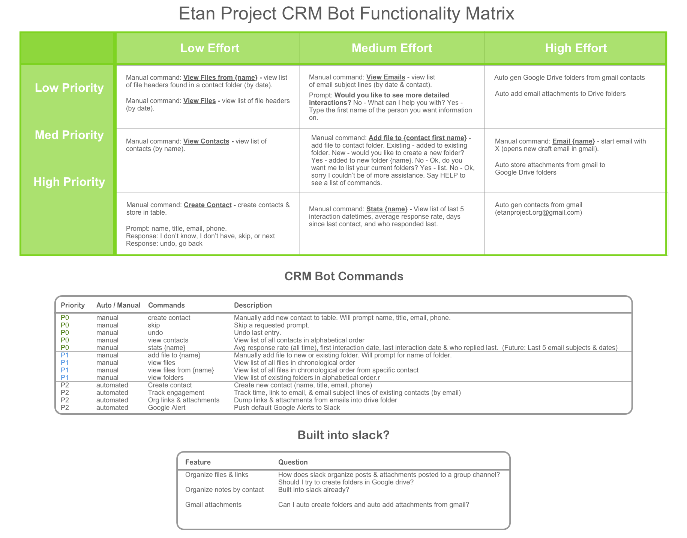
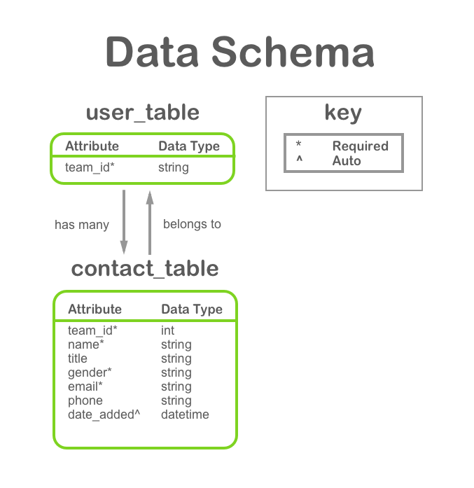
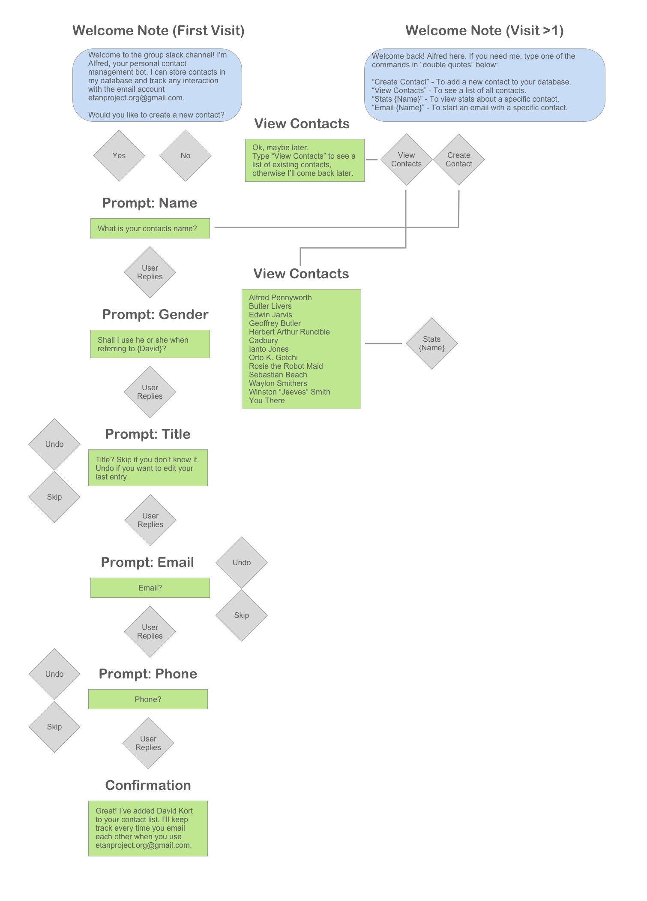
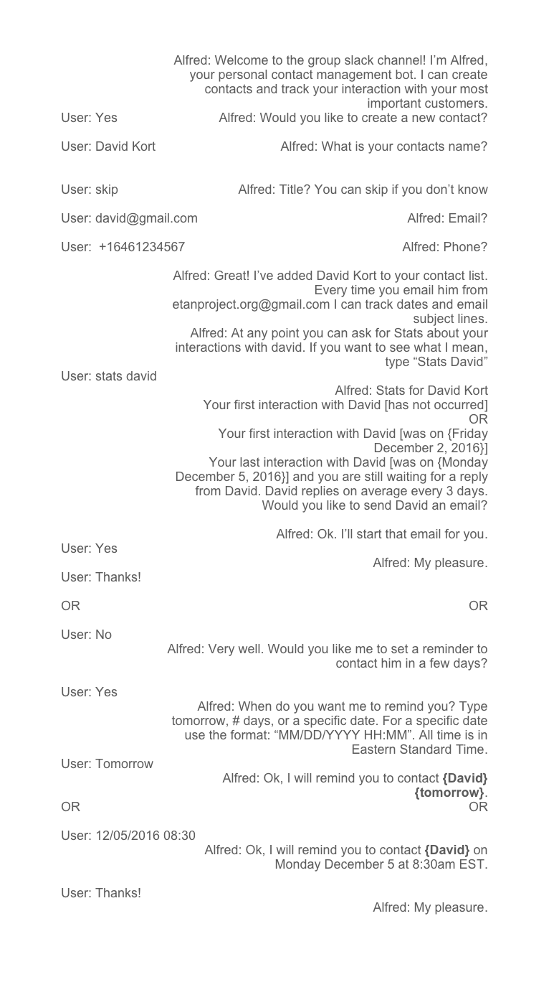

# Alfred the Botler Guide

### Who is Alfred?
Alfred the Botler is based on Batman's british butler Alfred Pennyworth. Alfred the Botler is highly educated, but as a bot can be a bit simple. He's learning his new role and soon will be up in tip top shape.

He is extremely polished and well behaved, but at times he becomes quite snarky and his remarks may get a bit off colored. You'll have to watch out for him, especially when you `dismiss` him.

**Alfred Pennyworth**

[Image Source](http://vignette2.wikia.nocookie.net/batman/images/2/24/Alfred_Pennyworth.png)

### What can he do?
Alfred knows you're very busy and in high demand, which is why he's offered to keep track of your contacts. He's still new, but eventually he'll be able to automatically store new contacts and start writing an email for you!

Sadly, however, at the moment he's only able to take down your contact's name, email, and phone number, view the contact list, or delete a contact.

### Future Integrations
In the future, Alfred will be able to get access to any email account (with your permission of course) and will be able to automatically store contacts and track your engagement with them.

He's a cheaky one, though, so when you say `hi` you'll notice he's already promising you these things. 

### Alfred's Commands

**Alfred Pennyworth's Training Schedule**

#### Functioning Commands
Command | Description
------------ | -------------
`add` | Type `add` and Alfred will guide you through the process of adding a new contact.
`skip` | The `skip` command provides a quick list of all add new contact commands. Keep in mind the listed commands only update the last contact in your list.
`help` | If at any point you feel stuck, just type `help`.
`view` | Shows a complete list of contact names and the number assigned to each one. This will be useful for the `delete contact` command.
`delete contact`| If you know the number assigned to a contact you can delete a specific contact
`delete all`| Be careful with this one! This will delete your entire contact database.
`hi`, `hey`, `hello` | Start talking to Alfred with any of these greetings. See what he says!
`dismiss`, `dismissed`, `bye`, `goodbye`, `good bye` | You can ask Alfred to leave you alone with any of these commands. 
`thank`, `thanks`, `thank you` | If you feel so inclined, thanks Alfred for his help. See what he says!

#### Hardcoded Commands
The following commands are hard coded and must be typed exactly as they appear below.
Command | Description
------------ | -------------
`When did I last contact Alfred?` | Only programmed for Alfred. Type exact phrase as it appears to the left.
`How long has it been since I contacted Jeeves?` | Only programmed for Jeeves. Type exact phrase as it appears to the left.
`what did you say about my mother?` | If Alfred mentions your mother, try typing `what did you say about my mother?`. Type exact phrase.

###Data Schemas

#Alfred Bot Workflows

#Sample Interaction

 

